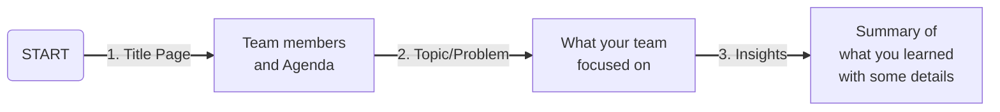
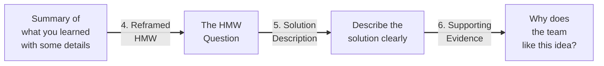
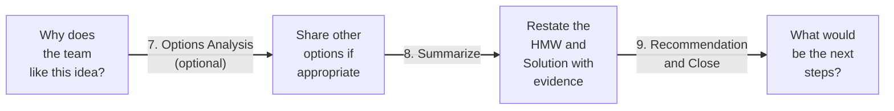

设计思维—应用创新课程的简单记录。
<!--more-->

<!-- @import "[TOC]" {cmd="toc" depthFrom=1 depthTo=6 orderedList=false} -->
<!-- code_chunk_output -->

* [批判性思维](#批判性思维)
	* [批判性思维的核心](#批判性思维的核心)
	* [思维谬误](#思维谬误)
	* [Deep Rooted Assumptions](#deep-rooted-assumptions)
* [团队](#团队)
	* [团队准则](#团队准则)
	* [棉花糖挑战](#棉花糖挑战)
* [Wicked Problems](#wicked-problems)
* [设计思维](#设计思维)
* [案头调查](#案头调查)
	* [数据库](#数据库)
	* [引用](#引用)
* [实地调查](#实地调查)
	* [调查](#调查)
	* [采访](#采访)
	* [观察](#观察)
	* [实地调查计划](#实地调查计划)
* [重构](#重构)
	* [确认核心问题](#确认核心问题)
	* [Creative Question: HMW](#creative-question-hmw)
	* [期中陈述](#期中陈述)
* [解决方案](#解决方案)
	* [头脑风暴](#头脑风暴)
	* [方案的筛选](#方案的筛选)
	* [Story boarding](#story-boarding)
	* [Final presentation storyboard](#final-presentation-storyboard)
* [链接](#链接)

<!-- /code_chunk_output -->

## 批判性思维
### 批判性思维的核心

- 对假设的质疑
- 定义对象
- 推理，提出论点以及对他人的论点进行思辨

Activity 1: Paper Bag Activity
为参加活动的二十位同学头上套上纸袋，然后让他们脱掉身上的衣物。结果只有一位同学脱掉了纸袋。

Activity 2：Please draw a picture: An old man saw a tree as he sat in a chair, looking through the window.
一句话可能有不同的解释。是我们通过窗户看到老人，还是老人透过窗户看到树？

### 思维谬误
1. 非黑即白（假两难推理）
1. 轻率概括    
1. 含义模糊    
1. 诱导性问题
1. 稻草人谬误
1. 滑坡谬误
1. 诉诸人身 (Getting Personal)
1. 轶事证据；传闻
1. 行话
1. 没有真正的苏格兰人

> We don't see things as they are, we see things as we are.
--Anais Nin

一厢情愿，还是为魔鬼代言。

### Deep Rooted Assumptions

## 团队
### 团队准则
团队，还是人的集合
1. 交流
1. 共同目标
1. 一套准则
1. 目标和准则对团队活动的方向和限制
1. 角色和人际关系网

### 棉花糖挑战
- 确认潜藏的假设
- 确认团队准则
- 原型的价值

## Wicked Problems
Wicked Problems = 从不同的角度来看问题，没有单一清晰的解决方案，没有永远不变的解决方案，只有好与不好的方案(注意不是对与错)

对于问题本身的不同定义决定了解决方案的方向

- 多元利益主体
- 众多不同的潜在答案
- 答案随时间变化

## 设计思维
考虑受众

设计者必须思考谁会使用他的设计。否则，他的设计不会是有价值的和可行的。

我的设计能满足使用者的什么需求？
我的设计能解决什么问题？
一个现有设计如何才能修改得对用户更友好？
怎样使我的设计更有趣？

## 案头调查
什么是案头调查？
为什么要做案头调查？
案头调查的优点和局限是什么？
### 数据库
如：
CGSS:中国综合社会调查
http://www.chinagss.org/
CFPS:中国家庭跟踪调查
http://www.isss.edu.cn/cfps/  
CLDS:中国劳动力动态调查
http://css.sysu.edu.cn/data/list
### 引用
- 了解他人贡献和先前研究
- 给予被引用者荣誉
- 提供证据支持你的看法

## 实地调查
### 调查
好的问卷问题的七个要点
https://www.youtube.com/watch?v=Iq_fhTuY1hw

活动：设计三个问题。扮演角色。交换角色。
### 采访
- 无关商业
- 足够多的调查人数
- 诱导，而非推动
- 故事胜于陈述
- 询问过去的行为，而非未来

### 观察
立场，视角，读者，代入。

### 实地调查计划
1. 你的假设是什么，你的焦点是什么？基于数据包、思维导图、案头调查。
1. 实地调查计划：任务，时间轴，分工。
1. 采访文档

## 重构
### 确认核心问题
Reframing = honing in on the actual issue based on insight from Sensing process

例：一些用户需要不一样的团队。或者，一些团队预先的假设是错的。

- 人物角色
- 移情地图
- 用户旅程

### Creative Question: HMW
GE MRI Case – From Terrifying to Terrific
- Original Brief: How to improve MRI experience?
- HMW: How might we create a fun environment that helps children to go through the MRI process

HMW [Action Verb] for a [User] who [Insight] and/or with [Need]
- E.g. HMW improve education for kids who cannot afford private school?
- E.g. HMW create a fun environment for children to go through the MRI process

### 期中陈述

从一个大的领域到几个 assumption area 的设立到有明确清晰的 Creative Question-HMW
thinking process（对核心问题/概念的定义，清晰的假设的设立和验证）
working process（案头调研，田野调研的具体 data/info 作为支撑）

将数据进行分类组合，找出 pattern 和 theme
总结出目标用户的 User Persona
找出目标用户的需求和洞察
将用户，需求和洞察结合形成 HMW Question

## 解决方案
寻找解决方案的过程又是一轮对于已知事物的研习以及对未知的探索。是新一轮的发散和收敛思维的过程。
寻找解决方案的过程从明确你的 HMW 问题开始，然后通过发散性思维来形成尽量多的想法。
当有了相当数量的想法以后，团队开始将想法进行整理、合并，形成几个有潜力的解决方案。然后通过理性思考来对有潜力的解决方案进行评估筛选，确定最有价值的方案。

### 头脑风暴

活动：预见未来

每个人单独写下你对未来的设想。想象一下2067年的未来：你所要解决的问题会是什么样？你的用户的生活会是怎样的？他们的最强烈的需求将会如何被满足？

在小组内分享你的故事，寻找相似的灵感或者方向

想象你们要共同为2067年3月的时代杂志的封面故事撰文。结合你们刚刚的个人设想和小组讨论，就你们课题为核心，展开描述。添加有趣的细节，尽可能展开想象为故事润色。时代杂志的封面请务必包含一下元素：故事的名称，副标题，摘要，插画。

Ideate
Co-create
Co-Create + Build Upon

### 方案的筛选

y轴：效果/影响力
x轴：可实现性

深入思考判断的标准。

没有完美的答案，只有不同的选择。

### Story boarding

Story boarding: take users through the story for feedback and concept improvement

Remember the presentation flow
- The Starting Point
- Your Team’s Insights
- Reframed HMW Question
- Solution and Supporting Evidence and User Feedbacks

### Final presentation storyboard

## 链接
设计思维课程主页：
https://dtsemshtu.wordpress.com/resources/
